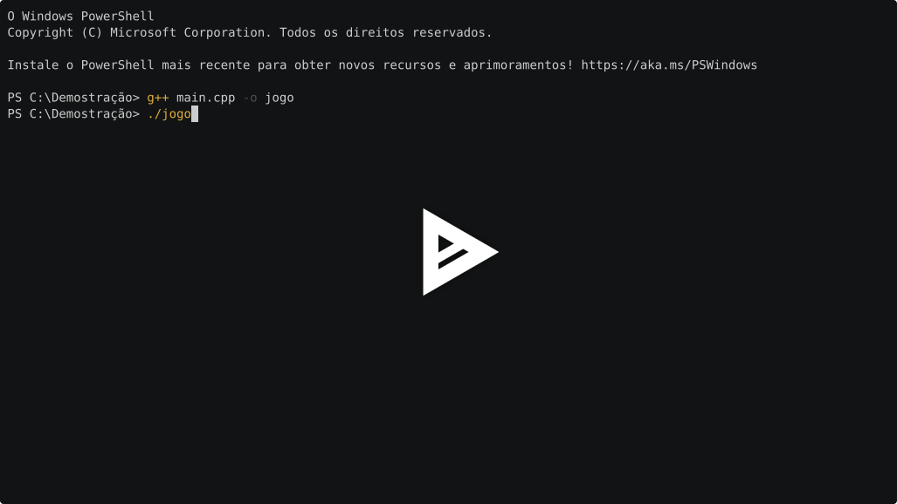

# 🎮 Jogo de Adivinhação de Números

Um jogo interativo desenvolvido em **C++** que roda diretamente no terminal. O projeto foi construído passo a passo para praticar conceitos de lógica de programação, controle de fluxo e versionamento com **Git e GitHub**.

## 🚀 Como funciona o jogo?

1. O computador sorteia um número secreto aleatório entre **1 e 100**.
2. O jogador tenta adivinhar o número digitando um palpite.
3. Caso o jogador queira desistir da partida atual, basta digitar **`0`**.
4. Se o jogador errar o palpite, o programa dá uma dica inteligente: diz se o número secreto é **MAIOR** ou **MENOR** do que o chute enviado.
5. O jogo continua em loop até que o jogador acerte ou desista. No final, o programa exibe uma mensagem personalizada mostrando o **total de palpites válidos** realizados.

## 🛠️ Tecnologias Utilizadas

* **C++** (Lógica do jogo, loops, condicionais, interrupções com `break` e geração de números aleatórios)
* **Git** (Controle de versão e histórico de etapas)
* **GitHub** (Hospedagem do repositório)

## 📌 Pré-requisitos

Para compilar e executar este jogo, você precisa de um **compilador C++ (g++)** instalado em sua máquina.

**Como verificar se você já possui o compilador:**

Abra o seu terminal (Prompt de Comando, PowerShell ou Terminal do Linux/Mac) e digite:

```bash
g++ --version
```

Se o comando retornar a versão do software, você já está pronto para jogar.

## Estrutura do Projeto

```bash
Jogo-de-advinha-o-main
├── imagens                     # Diretório para guardar imgens utilizadas no projeto.
│   └── player_demontracao.svg  # Banner do player para o link da demonstração.
├── README.md                   # Documentação principal com as instruções do projeto.
├── LICENSE                     # Arquivo contendo os termos legais da licença MIT.
└── main.cpp                    # Código-fonte em C++ contendo toda a lógica do jogo.
```

## 💻 Como Rodar o Projeto

Para compilar e rodar o jogo na sua máquina, abra o terminal na pasta do projeto e use os comandos:

```bash
# Compilar o código
g++ main.cpp -o jogo

# Rodar o jogo
./jogo
```

## Demonstração do Jogo

**Exemplo de Partida no Terminal:**

```text
Advinhe o numero secreto entre 1 e 100, caso queira desistir digite 0: 
50
O numero e MAIOR!
Advinhe o numero secreto entre 1 e 100, caso queira desistir digite 0: 
75
O numero e MENOR!
Advinhe o numero secreto entre 1 e 100, caso queira desistir digite 0: 
62
ACERTOU! O Numero e 62
Voce demorou 3 tentativas!
```

**Assista á demonstração!**
[](https://asciinema.org/a/YDRKToMcOiMkEWaY)  

---
*Desenvolvido por [nunes-xvt](https://github.com/nunes-xvt) 🚀*

## Licença

Este projeto está licenciado sob a Licença MIT - consulte o arquivo [LICENSE](https://github.com/nunes-xvt/Jogo-de-advinha-o/blob/main/LICENSE) para obter mais detalhes.
